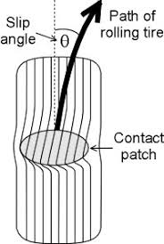
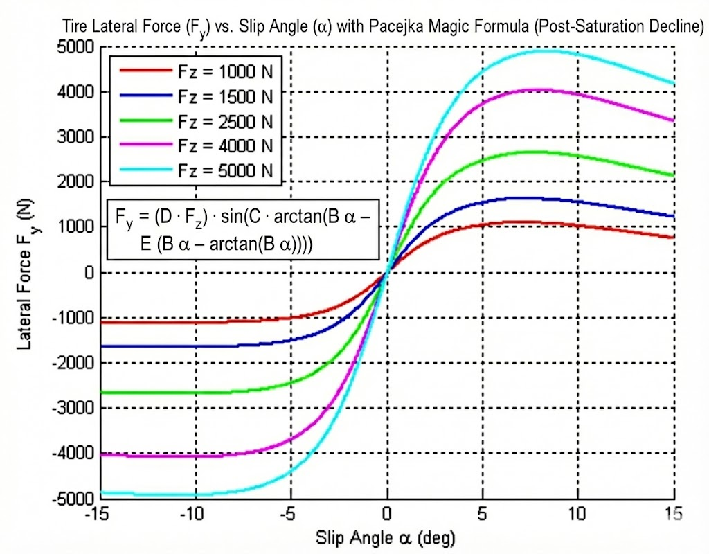
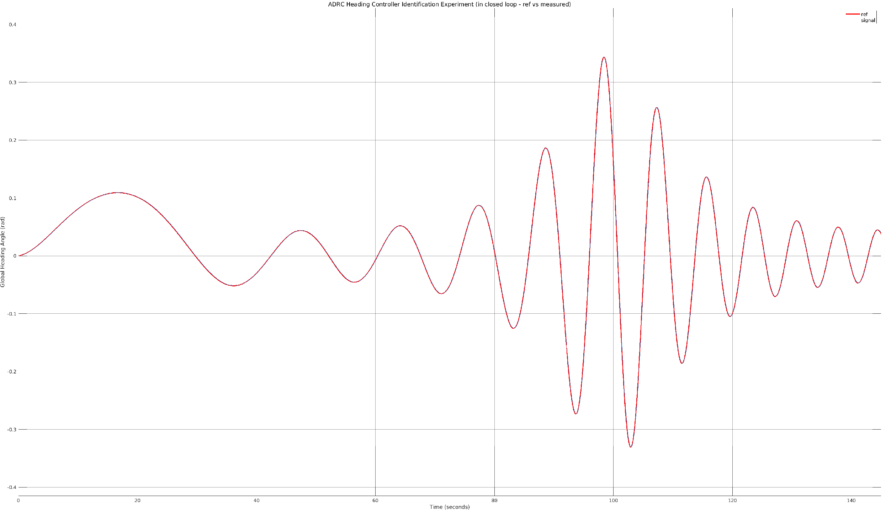
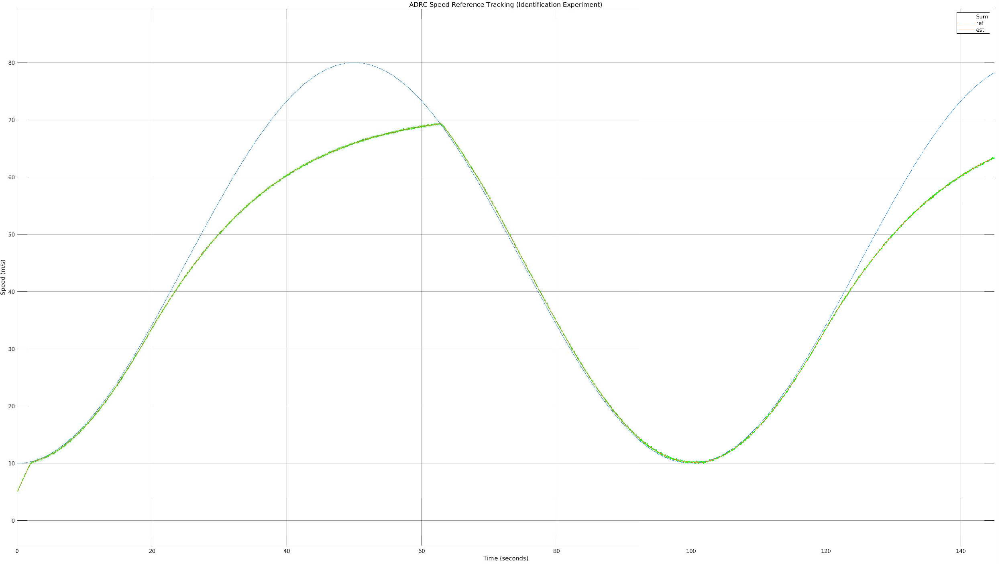

# Closed-Loop System Identification (SysID) for Non-Linear Vehicle Dynamics

## Project Overview and Motivation

Autonomous Racing is becoming an excellent testbed for Autonomous Transportation Systems. Autonomous Racing provides safe, controlled environments that allow researchers to push autonomous systems to their limits, this provides important data that can be used to improve the reliability and safety of AVs.

In racing at high speeds, the tires are usually at their limits of grip often, exciting non-linear regions that determine the limits between having traction and loosing it. Understanding tire behavior becomes of relevance then to understand the limits of grip of vehicles. Think of Formula 1 for instance, in the preparation for the qualifiers, they are usually practicing on the track, understanding the limits of grip and how much they can push on each corner to achieve a good time. Not operating at the limits is equivalent to 

This project presents a novel framework for identifying non-linear vehicle parameters (specifically Pacejka tire coefficients) using data collected from controlled closed-loop operation. Unlike classical open-loop identification, this approach leverages a model-based **Active Disturbance Rejection Control (ADRC)** architecture to stabilize the vehicle while collecting vehicle dynamics data that is later used for Identification. 

The core innovation is interpreting the **Extended Kalman Filter's (EKF)** "lumped disturbance" estimate ($\hat{x}_\xi$) as a "Virtual Force Sensor". This term measures the discrepancy between an internal linear model and the non-linear plant reality plus exogenous components of the disturbance. For this project, we assume that the disturbance acts at the input of the plant (just like the control signal(s)). In practice, it is expensive and uncommon to have sensors that measure forces directly, making (latent) state inference a valid way to compensate for the lack of direct sensing. 

We employ an offline **RTS Smoother** and **EM Algorithm** to refine these estimates into a post-processed dataset ready for identification. Finally, we minimize the KL Divergence between a Generative Grey-Box Model and the smoothed posterior to recover the physical parameters, using regularization.

## How to run?
**Note:** We use Matlab and Simulink, any version above 2020ish should work.
1. Clone the "main" branch 
2. Run the script **configure_simulation.m**, this will load the variables necessary to run the Simulink Simulator and collect the identification data.
3. Run the Simulink simulation, which is **single_track_v2.slx**, in the leftmost part you will find two manual switches, you dont have to touch this to run the simulation, but this allows you to toggle between validation (unseen) data and training. You can use either for train/val, I usually use the "generate_reference_trajectory" one for identification, but in practice, performing such maneuver (depending on the track) might not be possible. After the simulation is over, training data will be logged and saved in your Matlab Workspace. This simulation will run the ADRC - EKF based controller to perform an experiment in closed loop.
4. Run the file **EM_EKF_Tuner.m** from Matlab, this will run the EM algorithm that will find optimal process Noise Q and Measurement Noise R Matrices by running forward pass (EKF) and backward passes (RTS Smoother) iteratively and will maximize the log-likelihood. You can adjust the number of iterations. By default it has a decently tuned configuration, but you can mess it up and then run this to improve the process and measurement noises.
5. Now, you have your golden dataset ready for identification, run **identify_non_linear_tires.m** to identify the non-linear lateral dynamics by fitting the data using the knobs $\theta$.

## System Architecture: Two-Stage Pipeline

The pipeline is split into Online (Data Generation) and Offline (Learning) stages:

# Stage 1: The "Reflex" (Online Control and Estimation)

This stage runs in the Simulink environment (file single_track_v2.slx) and collects the data for the post-processing stage. Its purpose is to drive the vehicle using a stable ADRC control while simultaneously logging the necessary statistical data for the offline EM, RTS Smoother and Identification stages.

| Component | Role | Status |
| :--- | :--- | :--- |
| **Plant** | Vehicle Body 3DOF Single Track | Confirmed | Non-linear Pacejka tires and longitudinal load transfer. |
| **Controller** | Model-Based ADRC + FBL | Stable | Cancels estimated disturbancesf $\hat{\xi}$ and known linear dynamics ($N_v, N_r$) to track trajectory. |
| **Estimator** | Extended Kalman Filter (EKF) | Stable (EM Tuned) | Estimates 6 states ($v_x, v_y, r$) plus 3 disturbances ($\xi_x, \xi_y, \xi_{\psi}$). |
| **Excitation** | Multi-Stage Trajectory | Implemented | Uses a speed-ramping strategy (15 m/s $\to$ 80 m/s) and a yaw rate reference righ in frequential content to excite the full non-linear range of the tire curve. |

It is worth mentioning that on this work, the model used is the "bicycle model", a model that simplifies a 4 wheel car with two center "virtual tires", this is a common representation for controls because of it makes the control process simpler. For future work, this will be expanded for combined slip tire models and a dual track model.

 

## 1.1 The Non-Linear Plant Dynamics (Lateral Slip Model) (Generative Model and Identification Target Model)

The single-track non-linear lateral tire model is used for this work, this is the system  we are trying to identify. It is defined by the rigid body dynamics coupled with the $\mathbf{F}_z$-dependent Pacejka tire law. This forms the basis for the Stage 2 Generative Model.

### **Lateral Force Equation ($F_y$)**

For modeling of the lateral force, on a tire, a valid representation is the Pacejka Magic Formula, which calculates this highly non-linear force in function of the slip angles.
The core Pacejka model is applied to both the front and rear axles using their respective dynamic vertical loads $\mathbf{F}_z$:

$$
F_{y} = (D \cdot F_z) \cdot \sin\!\big(C \cdot \arctan(B \alpha - E (B \alpha - \arctan(B \alpha)))\big)
$$

Where $\alpha$ is the slip angle. We use $\alpha_f$ and $\alpha_r$ for the front and rear slip angles respectively. The slip angle is the difference in angle between the heading of the tire and the actual velocity vector of the vehicle. Wheeled vehicles need a sip angle to produce a lateral force, the tires can be thought as non-linear springs and dampers that when stressed laterally with a slip angle, produce a reaction force back that allows the vehicle to rotate (steer). The following image represents the concept of the slip angle:

The lateral tire forces usually have a behavior like this:

From the plot above, it can be observed that there is a linear region, after a certain threshold the force is saturated making the behavior non-linear, moreover, the plot doesn't just saturate, but it also presents a decreasing force behavior with higher slip angles. This plot is giving us the limits of lateral grip on the tire! Knowing where these limits are can tell us how much more lateral acceleration we can push in the corners.

NB: In practice though, there is also longitudinal slip, which creates a combined slip model, this is a more complicated model that also uses slip ratios, we will let this topic for **future work**.

### **Vertical Load ($F_z$)**

Load transfer is calculated dynamically, incorporating the longitudinal acceleration ($\hat{a}_x$), CG height ($h$) and centripetal acceleration ($\hat{v_y}\hat{r}$):

$$
\begin{aligned}
F_{z,f} &= \frac{l_r m g - (\hat{a}_x - \hat{v}_y \hat{r}) m h}{l_f + l_r}, \\
F_{z,r} &= \frac{l_f m g + (\hat{a}_x - \hat{v}_y \hat{r}) m h}{l_f + l_r}
\end{aligned}
$$

This load transfer coupling allows the front and rear axles to have different frictions with the ground while turning.

### **Non-Linear Dynamics ($\ddot{\psi}_{NL}$)**

The actual yaw acceleration in the plant is the complex non-linear sum of these forces (plus any aerodynamics/external effects):

$$
\ddot{y}_{NL} = \frac{F_{y,f} + F_{y,r}}{m} + a_{y,residual}
$$

For the identification, we use $a_{y,residual}=P_1*v_x^2 + P_2*v_y + P_3*r$, this is a residual linear combination of terms used to explain dynamics outside of the non-linear lateral forces; usually these terms are related with aerodynamic effects, which are scaled with velocities.

## 1.2 The Augmented Linear State Space (EKF and ADRC Model)

It is important to remember that the non-linear model above is assumed to be unknow because it is the target model to identify. Given this, we propose a linearized system that allow us to implement the ADRC framework, we use this framework to get estimates of disturbances that contain rich unmodelled linear and non-linear dynamics of the plant plus exogenous components of the disturbance (like a bump in the road).

We model the system as a Linear Time-Varying (LTV) process. 

The proposed state vector is

$$
\mathbf{x} = [v_x,\; v_y,\; r]^T
$$

However, in ADRC, we lump the unknown/unmodeled plant dynamic terms and discrepancies between our model and the real plant into lumped disturbance terms $\xi$. Hence, the state vector is augmented as follows

$$
\mathbf{x} = [v_x,\; v_y,\; r,\; \xi_x,\; \xi_y,\; \xi_\psi]^T
$$

Where: 
- $v_x$ is the forward speed
- $v_y$ is the lateral speed
- $r$ is the yaw rate
- $\xi_x$ is the lumped disturbance term in the longitudinal dimension ($F_x=ma_x$)
- $\xi_y$ is the lumped disturbance term in the lateral direction ($F_y=ma_y$)
- $\xi_\psi$ is the lumped disturbance term in the z rotational dimension ($M_z=I_z\alpha$)

Also, our control signals vector $u$ is 

$$
u = [F_{x,in}; \delta]
$$

Where $F_{x,in}$ is a longitudinal force (this is the force exerted by the engine to move the vehicle forward; which in reality is a non-linear function of throttle and brakes and gear shifting to acceleration), $\delta$ is the virtual steering angle of the bicycle model, which equivalently in a dual track model it will be the mean between the front left and front right steering angles given an Ackerman Steering vehicle (which is the handling configuration for most cars). 

The proposed continuous-time system is defined by the following augmented matrices, where coefficients are linearized around the previous state estimate $\hat{v}_x$.

### **Lateral and Yaw Coupling Terms**

$$
\begin{aligned}
Y_v &= -\frac{C_{\alpha f} + C_{\alpha r}}{m v_x}, 
&\qquad 
Y_r &= -v_x - \frac{C_{\alpha f}l_f - C_{\alpha r}l_r}{m v_x}, \\
N_v &= -\frac{C_{\alpha f}l_f - C_{\alpha r}l_r}{I_{zz} v_x}, 
&\qquad
N_r &= -\frac{C_{\alpha f}l_f^2 + C_{\alpha r}l_r^2}{I_{zz} v_x}
\end{aligned}
$$

Where $C_d$ is a drag coefficient, $l_f$ is the distance between the center of gravity and the front axle, $l_r$ the distance between COG and the rear axle in meters, $m$ is the mass in kg, $C_{\alpha_f}$ and $C_{\alpha_r}$ are the front and rear cornering stiffness, that (applying Hooke's law), is the linear spring coefficient of the tires (or axle in this case), which usually is given by $C_{\alpha} = B*C*D$ 

### **State Matrix** \($\mathbf{A}_{aug}$\)

$$
\dot{\mathbf{x}} =
\begin{bmatrix}
    -C_d/m & 0 & 0 & 1/m & 0 & 0 \\
    0 & Y_v & Y_r & 0 & 1/m & 0 \\
    0 & N_v & N_r & 0 & 0 & 1/I_{zz} \\
    \mathbf{0}_{3 \times 6}
\end{bmatrix}
\mathbf{x}
+ \mathbf{B}\mathbf{u}
$$

Notice that the three last rows are all zeros, this is common in the ADRC framework where the lumped disturbance terms are assumed to be constant, at least in an infinitesimal period of time, and allow the Extended-State Observer to estimate these lumped disturbance states with good bandwidth. 

Also, our C matrix for the output equation is

 <!-- 0, Yv, Yr + vx,  0, 1/m, 0; -->
$$
\mathbf{\check{x}}=
\begin{bmatrix}
    1 & 0 & 0 & 0 & 0 & 0\\
    0 & 1 & 0 & 0 & 0 & 0\\
    0 & 0 & 1 & 0 & 0 & 0\\
    0 & Y_v & Y_r & 0 & 1/m & 0\\
\end{bmatrix}
\mathbf{\check{x}}
$$

Notice that we output the lateral acceleration too in our last row of the C matrix. Then, the measurements are $[v_x, v_y, r, a_y]$.

## 1.3 ADRC Controller

Feedback-linearization-type control equations are proposed to control the **forward speed** and **yaw rate** of the vehicle, we make sure we include the lumped disturbance estimates into the feedback linearization terms as this will aim to cancel out the unmodeled dynamics of the plant, including non-linear terms. 

Notice that the first row of the $A_{aug}$ matrix is the forward acceleration dynamics, so we can inject the following control equation to cancel the plant's internal longitudinal dynamics: 

$$\mathbf{F_{x,in}} = m \cdot \left[ K_{1l}(v_{ref} - \hat{v}_x) - \frac{\hat{\tilde{\xi}}_x}{m} + \frac{C_d \hat{v}_x}{m} \right]$$

This control equation also injects a velocity error term, a P controller that stabilizes the speed while the FBL terms cancel all the remaining dynamics that are not part of the tracking error, for which we rely on the disturbance estimate $\xi_x$ from the Extended State Kalman Filter. 

On the other hand, for the yaw rate controller, we propose:

$$\mathbf{\delta} = \left[ \underbrace{K_{P}(\dot{\psi}_{ref} - \hat{r})}_{\text{P-Control Goal}} - (N_v \hat{v}_y + N_r \hat{r}) - \frac{\hat{\tilde{\xi}}_{\psi}}{I_{zz}} \right] \left( \frac{I_{zz}}{C_{\alpha f}l_f} \right)$$

Then, this yaw rate control structure is used to close and outside cascade controller, the following diagram represents the block diagram of the proposed controller:

**Controller Identification Experimental Results**

Heading controller (cascaded with the yaw rate ADRC):

Speed controller:

## 1.4 Extended State Kalman Filter Observer (EKF)

Standard EKF equations are used to compute the predicted recognition latent variables $\check{\mathbf{x}}_{t|t-1}$ and updated $\check{\mathbf{x}}_{t|t}$ state and covariance $P$. This algorithm runs online, and feeds the controller with the filtered states $\check{x}=[v_x, v_y, r, \xi_x, \xi_y, \xi_\psi]$ where $\xi_x$, $\xi_y$ and $\xi_\psi$ are not measured and are the lumped disturbance terms acounting for discrepancies in our linear model.

$$
\bar{\mathbf{x}}_{t|t-1} = \mathbf{A}_d \hat{\mathbf{x}}_{t-1|t-1} + \mathbf{B}_d \mathbf{u}_{t-1}
$$

$$
\mathbf{P}_{t|t-1} = \mathbf{A}_d \mathbf{P}_{t-1|t-1} \mathbf{A}_d^T + \mathbf{Q}
$$

$$
\mathbf{K}_t = \mathbf{P}_{t|t-1} \mathbf{C}_d^T (\mathbf{C}_d \mathbf{P}_{t|t-1} \mathbf{C}_d^T + \mathbf{R})^{-1}
$$

$$
\hat{\mathbf{x}}_{t|t} = \bar{\mathbf{x}}_{t|t-1} + \mathbf{K}_t (\mathbf{y}_t - \mathbf{C}_d \bar{\mathbf{x}}_{t|t-1})
$$

Where $P$ is the covariance, $K_t$ is the Kalman Gain.

**The following plot shows the reconstructed acceleration signal using the EKF estimate of $\xi_y$ which shows that the lateral acceleration can be properly reconstructed from the ESO-EKF**

---

# Stage 2: "Vehicle Ident" (Offline Learning)

This stage runs in MATLAB and uses advanced statistical filtering and optimization.

| Sub-Stage | Tool | Purpose |
| :--- | :--- | :--- |
| **Data Cleaning** | **RTS Smoother** | Runs backward on EKF logs to generate the high-fidelity, non-causal "Golden Dataset" $\check{x_{}}$ . |
| **Parameter Tuning** | **EM Algorithm** | Iteratively learns the optimal process noise ($\mathbf{Q}$) and measurement noise ($\mathbf{R}$) matrices, replacing manual tuning. |
| **Optimization** | **MultiStart + fmincon** | Minimizes the weighted error to identify the 11 parameters of the proposed Grey-Box Model. |

For the identiication of the non-linear system, we propose the following vector of parameters (knobs) to fit the model: 
$$\theta=[B_r, C_r, D_r, E_r, B_f, C_f, D_f, E_f, P_1, P_2, P_3]$$

Remembering that B, C, D and E are the tire pacejka parameters for front and rear. D is the peak grip, C is the shape factor (ie curvature of the whole curve), B is the stiffness factor and E is the curvature factor that determines how early the tire saturates.  

## 2.2  RTS Smoother and EM Algorithm

### Math for EM Algorithm for Kalman Filter and RTS Smoother Tuning

### Model Definition

The system is defined by a **Hidden Markov Model** structure, where:
* **Total State:** $X = \{X_0, \ldots, X_T\}$ (unobserved/hidden)
* **Observations:** $Y = \{Y_0, \ldots, Y_T\}$ (observed)
* **Parameters to be tuned:** $\phi = \{Q, R\}$. Note that we use $\phi$ parametrization because in our pipeline, this is the recognition model and the non-linear model is the generative, although we use the Kalman Filter in Generative Mode here to tune it through EM. 

#### State & Measurement Models (Linear Gaussian)

* **State Transition Model:**
    $$X_t = A X_{t-1} + B U_{t-1} + V_{t-1}$$
    where $V_t \sim \mathcal{N}(0, Q)$ (Process Noise)
* **Measurement Model:**
    $$Y_t = C X_t + W_t$$
    where $W_t \sim \mathcal{N}(0, R)$ (Measurement Noise)

---

### Complete Data Log Likelihood

The log-likelihood of the complete data ($\log p(X, Y | \phi)$) is defined as:
$$\log \mathcal{L}(X \mid Y ; \phi) = \log p(X_0 | \phi) + \sum_{t=1}^{T} \log p(X_t | X_{t-1}, \phi) + \sum_{t=1}^{T} \log p(Y_t | X_t, \phi)$$

#### Expressing the Gaussian PDFs (Ignoring constant terms):

Ignoring constant terms involving $2\pi$ and the determinants, the log-likelihood (up to a scaling factor) is:

$$
\mathcal{L}(\phi) \propto - \frac{1}{2} \sum_{t=1}^{T} \left[ (X_t - A X_{t-1} - B U_t)^T Q^{-1} (X_t - A X_{t-1} - B U_t) + \ln |Q| \right]
$$
$$
- \frac{1}{2} \sum_{t=1}^{T} \left[ (Y_t - C X_t)^T R^{-1} (Y_t - C X_t) + \ln |R| \right]
$$

---

### E-Step (Expectation)

The goal of the **E-Step** is to compute the expected value of the complete data log-likelihood given the observations $Y$ and the current parameter estimates.

Since $X$ is unknown, we compute the expected value of the sufficient statistics of $X$ (conditioned on all observations $Y_{1:T}$ and current parameters (of the recognition model).

#### Required Sufficient Statistics (from Kalman Smoother)
1.  **Smoothed State Mean:**
    $$\hat{X}_{t|T} = \mathbb{E}[X_t | Y_{1:T}]$$
2.  **Smoothed State Covariance:**
    $$P_{t|T} = \text{cov}(X_t | Y_{1:T}) = \mathbb{E}[ (X_t - \hat{X}_{t|T})(X_t - \hat{X}_{t|T})^T | Y_{1:T}]$$
3.  **Lag-one Cross-Covariance:**
    $$P_{t, t-1|T} = \text{cov}(X_t, X_{t-1} | Y_{1:T})$$

#### Algorithm 1: RTS Smoother (Backwards Pass)

* **Smoother Gain:** $J_t = P_{t|t} A^T P_{t-1|t-1}^{-1}$
* **Smoothed State:** $\hat{X}_{t-1|T} = \hat{X}_{t-1|t-1} + J_t (\hat{X}_{t|T} - \hat{X}_{t|t-1})$
* **Smoothed Covariance:** $P_{t-1|T} = P_{t-1|t-1} + J_t (P_{t|T} - P_{t|t-1}) J_t^T$
* **Lag-one Covariance:** $P_{t, t-1|T} = P_{t|t} J_t^T$

---

### M-Step (Maximization)

The **M-Step** maximizes the expected complete data log-likelihood $\mathcal{Q}(\phi, \phi^{(k)}) = \mathbb{E}_{X|Y, \phi^{(k)}} [\log \mathcal{L}(X \mid Y; \phi)]$ with respect to the parameters $\phi$.

#### Update for Measurement Noise Covariance ($R$)

* **New $R$ Estimate ($\hat{R}_{\text{new}}$):**
    $$\hat{R}_{\text{new}} = \frac{1}{T} \sum_{t=1}^{T} \left[ (Y_t - C \hat{X}_{t|T})(Y_t - C \hat{X}_{t|T})^T + C P_{t|T} C^T \right]$$

#### Update for Process Noise Covariance ($Q$)

* **New $Q$ Estimate ($\hat{Q}_{\text{new}}$):**
    $$\hat{Q}_{\text{new}} = \frac{1}{T} \sum_{t=1}^{T} \mathbb{E}[(X_t - A X_{t-1} - B U_t)(X_t - A X_{t-1} - B U_t)^T | Y_{1:T}]$$

#### $\mathcal{Q}_{\text{new}}$ Expression (for matrix $A$ update, $B=0$, $U_t=0$)

Your note shows the partial result for updating $\mathcal{Q}$:
$$
\mathcal{Q}_{\text{new}} \propto - \frac{1}{2} \sum_{t=1}^{T} \left[ \Sigma_t + A P_{t-1|T} A^T + P_{t|T} - P_{t, t-1|T} A^T - A P_{t, t-1|T}^T \right]
$$
Where $\Sigma_t = (\hat{X}_{t|T} - \hat{X}_{t|t-1}) (\hat{X}_{t|T} - \hat{X}_{t|t-1})^T$.

---

## 2. Theoretical Core: The Loss Function Derivation

The identification process is founded on maximizing the likelihood of the Pacejka model, given the data from the EKF.

### A. The Generative Model Framework

We define the two models involved in the optimization:

| Model | Notation | Definition | Role |
| :--- | :--- | :--- | :--- |
| **Recognition Model** | $q_{\phi}(\mathbf{x} \mid \mathbf{y})$ | EKF + RTS Smoother | Provides the fixed "Ground Truth" data set ($\hat{x}_{t \mid T}$). |
| **Generative Model** | $p_{\theta}(\mathbf{x}, \mathbf{y})$ | Pacejka + NL Dynamics | Our physics hypothesis, parameterized by $\theta$. |

<!-- | Model | Notation | Definition | Role |
| :--- | :--- | :--- | :--- |
| **Recognition Model** | $q_{\phi}\mathbf{x}|\mathbf{y}$ | EKF + RTS Smoother | Provides the fixed "Ground Truth" data set $\hat{x}_{t,T}$. |
| **Generative Model** | $p_{\mathbf{\theta}}(\mathbf{x}, \mathbf{y})$ | Pacejka + Dynamics | Our physics hypothesis, parameterized by $\mathbf{\theta}$. | -->

The objective is to minimize the **KL Divergence** between these models, which is equivalent to solving a **Maximum Likelihood Estimation (MLE)** problem.

### B. The Final Loss Function (Weighted Least Squares)

By assuming Gaussian noise, the MLE problem can be simplified to minimizing the **Variance-Weighted Sum of Squared Errors (WSSE)**.

$$L(\mathbf{\theta}) = \sum_{t=1}^{T} \frac{\left( a_{y, target}(t) - a_{y, pred}(t, \mathbf{\theta}) \right)^2}{max(\sigma_t^2, \sigma^2_{min})} + \lambda_{reg}\|\mathbf{\theta} - \mathbf{\theta}_{prior}\|^2 + \lambda_{sim}\|\mathbf{\theta}_{front} - \mathbf{\theta}_{rear}\|^2$$

In practice, the simple loss function 

$$L(\mathbf{\theta}) = \sum_{t=1}^{T} (a_{y, target} (t) - a_{y, pred}(t))^2 $$

Works well too in our experiments (and even better). The variance normalization in **the complicated loss function suffers from a problem, the smoother will assign lower certainty for very non-linear regions, exactly the ones we aim to identify**, the simple squared error doesn't suffer from this problem. This is the reason why in the complicated loss function, we have a max that clamps to some value, **but for future work, a more refined loss that can capture better the non-linear regions will be developed**.

| Term | Purpose | Source |
| :--- | :--- | :--- |
| $a_{y, target}$ | **Target Signal** | Reconstructed from $\hat{\xi}_{y,t|T}$ (The Smoothed Lateral Disturbance). |
| $\mathbf{1}/\mathbf{\sigma_t^2}$ | **Weighted Loss** | Inverse of the Smoother's covariance ($\mathbf{P}_{t|T}$). Ensures focus on high-confidence data. |
| $\lambda_{reg}$, $\lambda_{sim}$ | **Regularization** | Soft constraints to ensure the identified parameters are physically plausible and symmetric (front $\approx$ rear). |

---

## 3. Implementation and Robustness

### Problems faced during implementation
* **EKF Model Fix:** The $\mathbf{A}$ matrix is dynamic (EKF) and uses time-varying cornering stiffness $C_{\alpha}(t)$ computed from logged $F_z$ data, resolving a critical model mismatch problem.
* **Simulink uses g's as acceleration units** This was causing reconstructed acceleration to be way off the ground truth. 
* **Sign Convention Fix:** All models (Simulink, EKF, Pacejka) are aligned to the correct ISO sign convention, preventing negative parameter convergence.
* **Numerical Stability:** The EKF uses the stable Joseph Form for covariance updates, and the EM algorithm implements **safety floors** on $\mathbf{Q}$ and $\mathbf{R}$ to prevent covariance collapse.

### Other Core Files
* `identify_non_linear_tires.m` (Main Execution Script)
* `forward_KF_EM.m` / `RTS_smoother_EM.m` (Estimation Logic)
* `predict_NL_accel.m` (The Grey-Box Model)

### 4. Results 

After identifying the 11 parameters to the best of our fit, we got the following results thrown by **identify_non_linear_tires.m**:

   74         950    1.136197e+01     0.000e+00     1.000e+00     1.256e-02     2.123e+01  
   75         962    1.136195e+01     0.000e+00     1.000e+00     9.957e-02     4.763e+01  
   76         974    1.136193e+01     0.000e+00     1.000e+00     3.072e-02     2.917e+01  
   77         987    1.136193e+01     0.000e+00     7.000e-01     7.513e-02     4.397e+01  
   78         999    1.136191e+01     0.000e+00     1.000e+00     1.325e-02     2.103e+01  
   79        1011    1.136191e+01     0.000e+00     1.000e+00     6.786e-02     2.066e+01  
   80        1023    1.136190e+01     0.000e+00     1.000e+00     2.586e-02     1.309e+01  
   81        1035    1.136190e+01     0.000e+00     1.000e+00     4.988e-02     1.068e+01  
   82        1047    1.136189e+01     0.000e+00     1.000e+00     3.147e-02     4.467e+00  
   83        1059    1.136189e+01     0.000e+00     1.000e+00     6.223e-02     2.270e+01  
   84        1071    1.136189e+01     0.000e+00     1.000e+00     3.777e-02     9.178e-02  

Local minimum found that satisfies the constraints.

Optimization completed because the objective function is non-decreasing in 
feasible directions, to within the value of the optimality tolerance,
and constraints are satisfied to within the value of the constraint tolerance.

<stopping criteria details>
--- UNIT TEST RESULTS ---
Ground Truth: [22, 1.8, 1.6, 0.8]
Identified:
   17.3461    1.2192    2.6417    0.7022   24.4151    1.7344    1.7046    1.4463         0         0         0

   